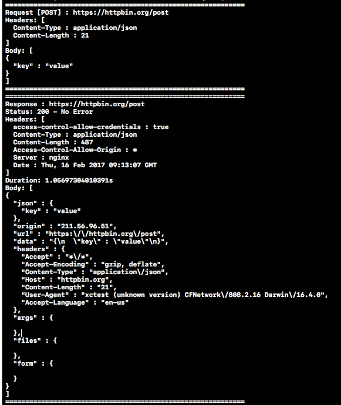

# Sniffer

- Automatic networking activity logger
- intercepting any outgoing requests and incoming responses for debugging purposes.



## Requirements
- iOS 8.0+
- Swift 3.0

## Example
To run the example project, clone the repo, and run `pod install` from the Example directory first.

## Installation

#### CocoaPods
Sniffer is available through [CocoaPods](http://cocoapods.org). To install
it, simply add the following line to your Podfile:

```ruby
use_frameworks!
pod "Sniffer"
```

## Usage

#### for any requests you make via 'URLSession'

```swift
func application(_ application: UIApplication, didFinishLaunchingWithOptions launchOptions: [UIApplicationLaunchOptionsKey: Any]?) -> Bool {
  Sniffer.register() // Register Sniffer to log all requests
  return true
}
```

#### for URLSessionConfigure

```swift
let configuration = URLSessionConfiguration.default
Sniffer.enable(in: configuration)
```

#### for Custom Deserializer

```swift
public protocol BodyDeserializer {
    func deserialize(body: Data) -> String?
}

public final class CustomTextBodyDeserializer: BodyDeserializer {
    public func deserialize(body: Data) -> String? {
        // customization
        return String?
    }
}

Sniffer.register(deserializer: CustomTextBodyDeserializer(), for: ["text/plain"])

```

## References
- Timberjack (https://github.com/andysmart/Timberjack)
- ResponseDetective (https://github.com/netguru/ResponseDetective)

## Authors

Taeun Kim (kofktu), <kofktu@gmail.com>

## License

Sniffer is available under the ```MIT``` license. See the ```LICENSE``` file for more info.
